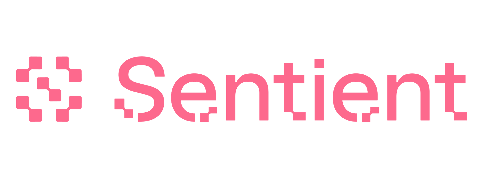

<h1 align="center">Sentient Enclaves Framework</h1>

<!-- Socials -->
<p align="center">
      <a href="https://sentient.xyz/" target="_blank" style="margin: 2px;">
    
  </a>
  <!-- Github Repo Info -->
    <!-- Release -->
    <a href="https://github.com/sentient-agi/Sentient-Enclaves-Framework/releases/tag/v0.6.0">
        
    </a>
    <!-- License -->
    <a href="./LICENSE-APACHE">
        
    </a>
    <!-- status as beta -->
    <a>
        
    </a>
</p>
       
<p align="center">
  
</p>

Welcome to the Sentient Enclaves Framework. The framework provides end-to-end infrastructure for building confidential AI applications using TEEs.


# List of Contents 📚


- [Detailed project reference](docs/md/REFERENCE_README.md)


- [Diagrams](docs/md/REFERENCE_README.md#visualization-of-sentient-enclaves-framework-infrastructure-components-and-its-interaction-with-diagrams)


- [Getting started (quick start) guide](docs/md/BUILDING.md)


- [Usage and advanced usage guide](docs/md/USAGE.md)


- [Demonstrations](docs/md/REFERENCE_README.md#demonstrations)


- [Reference applications](reference_apps/)


- [Changelog](docs/md/CHANGELOG.md)


- [Roadmap](docs/md/ROADMAP.md)


- [License](LICENSE)


# Overview 🔍

Trusted Execution Environments (TEEs, aka Confidential Computing Environments) are a type of hardware-based security mechanism
that allows for the secure execution of code in a protected environment (hardware isolated memory area).
TEEs are designed to provide a secure and isolated execution environment for applications that handling sensitive data (data-sets), such as AI models, by ensuring that the code and data are protected from any unauthorized external access.
This framework provides a comprehensive infrastructure for building confidential AI applications using AWS's [Nitro Enclaves](https://aws.amazon.com/ec2/nitro/nitro-enclaves/) offering.
The framework enables the creation of confidential enclaves that are isolated from the host machine and operator (cloud provider) infrastructure. 


# Features 🔥

- Seamlessly setup and deploy confidential AI applications in TEEs 🚀
- Generate reproducible builds and verifiable build hashes for enclave image and applications 🔐
- Access internet services inside isolated enclave using forward proxies 🔌
- Deploy internet-facing applications inside enclave using reverse proxies 🌐


# Framework Components 🏗️
To allow for the creation of confidential AI applications set of infrastructure components are needed. The framework abstracts these components away from the developer, providing a simple interface for building confidential AI applications. Framework provides following components:

| Component | Description | Functionality | Documentation                                                                                                                                    |
|-----------|-------------|---------------|--------------------------------------------------------------------------------------------------------------------------------------------------|
| `pipeline` | Implementation of binary protocol over `vsock` for interacting with enclave | Controls enclave execution and enables bi-directional file transfers | [](docs/md/REFERENCE_README.md#pipeline-slc-vsock-communication-protocol)         |
| `rbuilds.sh` | Script utilising set of components for building reproducible enclave images | Enables byte-level reproducibility for enclave images and streamlines the build process | [](docs/md/REFERENCE_README.md#build-system-for-enclaves-reproducible-builds) |
| `pf-proxy` | Transparent `vsock` proxies for internet-enabled applications | Provides full networking stack support, enabling outbound TCP connections using forward proxies and inbound TCP connections using reverse proxies for enclaves | [](docs/md/REFERENCE_README.md#transparent-vsock-proxies)                         |

### Project Diagram:

> [!NOTE]
> #### More details about these components and other framework components that are under development can be found in the [Detailed project reference README](docs/md/REFERENCE_README.md).
>

<p align="center">
  
  <h3 align="center">Figure 1: Shows overall framework architecture and interactions between components</h3>
</p>

# Getting Started 🚀

## Building the components
### Prerequisites 📋
- [Nitro-enabled AWS EC2 instance](https://docs.aws.amazon.com/enclaves/latest/user/nitro-enclave.html#nitro-enclave-reqs)
- [Docker](https://docs.docker.com/get-docker/)

### Building core components of the framework 🛠️
Building the core components of the framework is done using the `rbuilds.sh` script. This script simplifies the process of building the components and handles all the dependencies. Exact steps are available in the [BUILDING.md](docs/md/BUILDING.md) file.

### Building and running apps ⚡
Once the core components are built, the apps can be built and run using the `rbuilds.sh` script. [Reference apps](reference_apps/) directory contains example applications that utilize the framework. Each reference application follows the following structure:

```
reference_apps/
├── reference_app_name : Name of the reference application
│   ├── reference_app_name.dockerfile : Template Dockerfile for building the application with necessary dependencies to run inside enclave
│   ├── TEE_rbuilds_setup.md: Application setup guide for building and running the application using rbuilds.sh
│   ├── TEE_setup.md: Legacy setup guide
```

To run any of the reference applications, the steps outlined in the respective `TEE_rbuilds_setup.md` should be followed.


# Directory Structure 📁
Project follows the directory structure given below:
```
sentient-enclaves-framework/
├── pipeline : source code for pipeline component for interacting with enclaves
├── pf-proxy : Source code for transparent vsock proxies for internet-enabled applications
├── rbuilds
│   ├──*.dockerfile : Dockerfile used for different stages while building enclave images
│   ├── rbuilds.sh: Script for building reproducible enclave images 
├── rbuilds.legacy : Legacy build system for building enclave images. Currently not used.
├── reference_apps : Reference applications that utilize the framework
│   ├── fingerprinting_server : A model fingerprinting server that fingerprints models based on OML fingerprinting library
│   ├── inference_server : An inference server that uses a local model inference.
│   ├── X_Agent : A reference agent that interacting with X users.
├── web-ra: Web Server for remote attestation of enclaves (WIP)
└── docs : Detailed documentation for the framework and its components  

```

# Contributing 🤝
> [!IMPORTANT]
> Contributions are welcome! Contribution guidelines will soon be available.

# License 📝
This project is licensed under the [Apache 2.0 License](LICENSE-APACHE).

