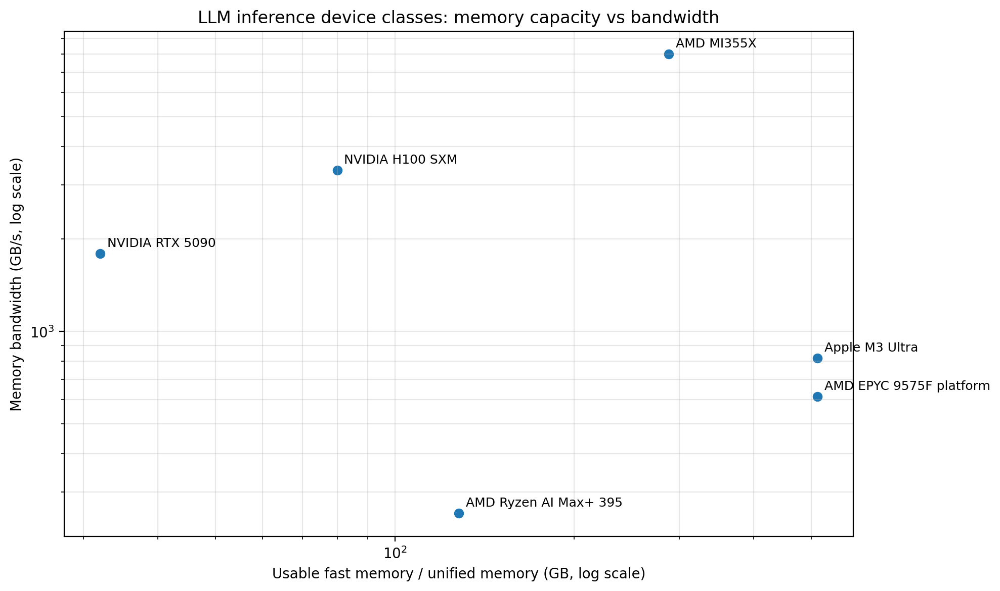

# LLM Inference on CPUs, APUs, NPUs, and GPUs

## A practical sizing guide for 70B–671B-class models

This guide compiles the earlier research efforts into a single planning document for local and server-side LLM inference on modern:

- CPU servers with DDR5
- unified-memory APUs / AI PCs
- Apple-style large unified-memory systems
- consumer GPUs with GDDR VRAM
- datacenter GPUs with HBM
- NPUs where relevant

The focus is on **single-device fit** and **steady-state decode speed** in **tokens per second**, especially for models such as:

- Llama 70B
- gpt-oss-120b
- Llama 405B
- DeepSeek-R1 671B

---

## Executive summary

The most important takeaway is:

> For large-model decode, performance is usually dominated more by **memory bandwidth** and **whether the model fully fits in fast local memory** than by SIMD ISA support alone.

SIMD and tensor instructions still matter:

- SSE / AVX / AVX2 / AVX-512 / AVX10 / AMX on x86
- NEON / SVE on Arm
- specialized matrix engines on NPUs and GPUs

But once kernels are reasonably optimized, the practical ceiling for batch-1 decode is mostly determined by:

1. **Fast-memory capacity**: does the quantized model fully fit?
2. **Fast-memory bandwidth**: how many bytes can be streamed per generated token?
3. **Runtime efficiency**: fused dequant + GEMM, MoE routing, KV-cache handling, attention kernels, scheduling, NUMA locality

This creates a simple hierarchy:

- **Consumer GDDR GPUs**: extremely fast **if the model fits**, but capacity-limited
- **Large unified-memory systems**: slower than HBM GPUs, but much better single-box scalability
- **DDR5 CPU servers**: capacity-rich and flexible, but lower decode tok/s
- **HBM datacenter GPUs**: best absolute speed, and increasingly also strong on capacity

---

## Scope and assumptions

Unless otherwise stated, this document assumes:

- **single-stream decode** as the main metric
- model weights are approximately **~4-bit class** after loading
- numbers are **planning-grade estimates**, not guaranteed benchmarks
- prompt/prefill throughput is a different regime and can scale very differently from decode

---

## Why bandwidth dominates decode

At decode time, each generated token requires reading a substantial portion of the model state and running the relevant layers. For large models, this often looks like a streaming problem:

- weights are read from memory
- dequantized or partially dequantized on the fly
- dense or sparse blocks are executed
- KV-cache is read/written
- the next token is emitted

For sufficiently large models, this means:

- adding wider SIMD helps, but only up to the point that compute is no longer the bottleneck
- after that, **DRAM / LPDDR / GDDR / HBM bandwidth** dominates
- if the model spills out of fast local memory, tok/s can collapse sharply

This is why a lower-bandwidth but very large-memory system can host giant models that a much faster GPU cannot fit, while a GPU can be dramatically faster on models that do fit.

---

## The sizing model

The cleanest way to size inference is to separate **fit** from **speed**.

### 1) Fit / capacity model

```text
weight_store_GB  ≈ total_params_B × (quant_bits / 8) × load_overhead
kv_cache_GB      ≈ 2 × layers × kv_width × ctx_len × batch × kv_bytes / 1e9
required_mem_GB  ≈ weight_store_GB + kv_cache_GB + scratch_GB
```

Where:

- `total_params_B` = total parameter count in billions
- `quant_bits` = loaded precision, often around 4-bit for these planning examples
- `load_overhead` = runtime overhead from metadata, alignment, experts, format conversion, etc. A useful planning range is **1.05–1.15**
- `kv_cache_GB` depends heavily on architecture, KV format, context length, and batch size
- `scratch_GB` includes workspace, graph runtime, fragmentation headroom, routing buffers, etc.

### 2) Decode / generation model

```text
tok/s ≈ (peak_mem_bandwidth_GBps × efficiency_eta) / effective_bytes_per_generated_token
```

Where:

- `peak_mem_bandwidth_GBps` = fast local memory bandwidth
- `efficiency_eta` = how much of that you actually realize in end-to-end inference
- `effective_bytes_per_generated_token` = a model- and runtime-dependent measure of how many bytes must be streamed per decoded token

A useful approximation is:

```text
effective_bytes_per_token ≈ decode_equiv_params_B × (quant_bits / 8) + kv_stream_bytes
```

Where `decode_equiv_params_B` is the most important planning abstraction in this document.

---

## Total params vs active params vs decode-equivalent params

A model has at least three useful “sizes” for inference planning:

1. **Total params**
   - decides how much storage is needed to hold the model
2. **Active params per token**
   - especially relevant for MoE models
3. **Dense-equivalent decode size**
   - a planning abstraction for actual decode cost once routing, dense blocks, attention, dequant, and runtime overhead are included

For dense models, these are close. For MoE models, they can be very different.

### Model planning table

| Model | Architecture | Total params | Active params / token | Approx loaded size @ ~4-bit | Decode-equivalent planning size |
|---|---:|---:|---:|---:|---:|
| Llama 70B | Dense | 70B | ~70B | ~38–42 GB | ~70B |
| gpt-oss-120b | MoE | ~117B | ~5.1B | ~60–65 GB | ~10–14B |
| Llama 405B | Dense | 405B | ~405B | ~212–233 GB | ~405B |
| DeepSeek-R1 671B | MoE | 671B | ~37B | ~352–386 GB | ~45–55B |

### What this means in practice

- **gpt-oss-120b** stores like a large model, but decodes more like a much smaller dense model
- **DeepSeek-R1 671B** is gigantic to store, but decode behaves more like a very heavy 70B / 120B-class model rather than a true dense 671B monster
- **dense 405B** is hard in both dimensions: storage and decode

---

## Device-class map

### ASCII diagram

```text
DEVICE-CLASS MAP (single-device, fast-memory fit)

Highest capacity that still stays "fast"
^
| 512 GB  : Apple M3 Ultra / large UMA
| 512 GB+ : 12-ch DDR5 server CPU
| 288 GB  : MI355X-class HBM GPU
| 128 GB  : Ryzen AI Max+ 395 / client UMA APU
|  80 GB  : H100-class HBM GPU
|  32 GB  : RTX 5090-class GDDR GPU
+------------------------------------------------------------>
      256       614        819       1792       3350      8000
                    memory bandwidth (GB/s)

Rule of thumb:
- GDDR GPU = very fast if it fits, poor for giant full-weight models
- DDR / UMA = slower, but much better single-box scalability
- HBM GPU = best speed tier, and increasingly also a capacity tier
```

### Rendered comparison asset



Fallback link: [Open the PNG diagram](assets/llm_inference_device_classes.png)

---

## Device-class matrix

The following table assumes **single-device fit in fast local memory** at roughly **~4-bit loaded weights**.

### Fit matrix by device class

| Device class | Representative device | Fast memory | Bandwidth | Dense 70B | gpt-oss-120b | Dense 405B | DeepSeek-R1 671B | Main takeaway |
|---|---|---:|---:|---|---|---|---|---|
| Client UMA APU / AI PC | Ryzen AI Max+ 395 | 128 GB | 256 GB/s | Yes | Yes | No | No | Good local tier for 70B and efficient MoE models |
| Apple UMA workstation | M3 Ultra | 512 GB | 819 GB/s | Yes | Yes | Yes | Yes | Best current single-box local class for giant models |
| Server CPU / DDR5 | EPYC-class 12-ch DDR5 server | 512 GB+ | 614 GB/s | Yes | Yes | Yes | Yes | Capacity-first class; slower than HBM, but scalable |
| Consumer GPU / GDDR7 | RTX 5090 | 32 GB | 1,792 GB/s | No | No | No | No | Very fast only when the whole model fits |
| Datacenter GPU / HBM3 | H100 SXM | 80–94 GB | 3,350–3,900 GB/s | Yes | Yes | No | No | High-speed fit tier for 70B and gpt-oss-120b |
| Datacenter GPU / HBM3E | MI355X | 288 GB | 8,000 GB/s | Yes | Yes | Yes | No | Current single-device sweet spot for fast 405B-class serving |

### Model fit shorthand @ ~4-bit

| Model | Approx loaded size | Single-device fit notes |
|---|---:|---|
| Llama 70B | ~40 GB | Fits in H100-class, large UMA, large DDR, not in 32 GB consumer GPU |
| gpt-oss-120b | ~61 GB | Fits in H100-class, large UMA, large DDR, not in 32 GB consumer GPU |
| Llama 405B | ~220 GB | Needs very large UMA, big DDR server, MI355X-class HBM, or multi-GPU sharding |
| DeepSeek-R1 671B | ~360–380 GB | Needs large UMA, large DDR server, or multi-HBM-GPU sharding |

---

## Observed benchmark anchors

These are representative real-world decode anchors that are useful for calibration.

| System | Device class | Llama 70B | gpt-oss-120b | Llama 405B | DeepSeek-R1 671B | Notes |
|---|---|---:|---:|---:|---:|---|
| Framework Desktop Mainboard (128 GB) | Client UMA APU | 4.97 tok/s | up to 30 tok/s | — | — | Strong example of an efficient 128 GB local box |
| Mac Studio M3 Ultra (512 GB) | Apple UMA workstation | 14.08 tok/s | — | 1.96 tok/s | 19.89 tok/s | Best clean local “everything fits” benchmark class |
| AmpereOne A192-32X (512 GB) | Server CPU / DDR | 3.86 tok/s | — | 0.90 tok/s | 4.18 tok/s | Capacity-rich CPU-only baseline |

### What these anchors show

- **70B dense models** land in the single digits to low teens tok/s on modern non-HBM devices
- **405B dense models** are usually around ~1–2 tok/s even on very strong single-box systems
- **gpt-oss-120b** can be much faster than its total parameter count suggests because of its MoE structure
- **DeepSeek-R1 671B** is storage-huge but decode-lighter than a dense 671B model

---

## Expected decode envelopes by device class

The following ranges are planning envelopes for **single-stream decode** with a strong custom runtime.

### Planning table: expected tok/s by device class

| Device class | Llama 70B | gpt-oss-120b | Llama 405B | DeepSeek-R1 671B | Comments |
|---|---:|---:|---:|---:|---|
| Client UMA APU / AI PC (~256 GB/s) | ~4–6 | ~20–35 | ~0.7–1.2 | ~3–6 | Good value tier if model fits |
| Server CPU / DDR5 (~500–600 GB/s) | ~4–8 | ~25–40 | ~0.8–1.5 | ~4–8 | Capacity-rich, slower per-byte than HBM |
| Apple large UMA (~819 GB/s) | ~12–18 | ~60–80 | ~1.5–2.5 | ~12–18 | Strongest current single-box local class |
| Consumer GPU / GDDR7 (single 32 GB card) | N/A | N/A | N/A | N/A | None of the listed models fully fit on a single 32 GB device |
| H100-class HBM GPU (single device, if fully fit) | ~40–80 | ~80–160 | N/A | N/A | Capacity-limited for larger full-weight models |
| MI355X-class HBM GPU (single device, if fully fit) | ~80–160 | ~150–300 | ~15–35 | N/A | Extremely high bandwidth, assuming the model fits cleanly |

### Important warning

GPU rows above assume:

- the model fully fits in fast local HBM/GDDR
- the serving stack is well-optimized
- no catastrophic spill to slower memory tiers

If the model does **not** fit and must be partially offloaded, the effective bandwidth roofline changes completely and tok/s can collapse.

---

## Why GDDR GPUs are both amazing and frustrating

Consumer GPUs with GDDR VRAM have a very appealing profile:

- very high memory bandwidth
- mature tensor/matrix execution
- excellent software ecosystems
- very high tok/s for models that fit

But they also suffer from the sharpest **capacity cliff**:

- a single 32 GB card is too small for full 70B-class 4-bit loads with comfortable runtime headroom
- it is far too small for gpt-oss-120b, dense 405B, or DeepSeek-R1 671B
- once you spill to host memory or use aggressive offload, performance can degrade dramatically

### Practical interpretation

- **GDDR consumer GPUs** are best for smaller models, smaller MoEs, distillations, and quantized models that fit entirely in local VRAM
- for the giant models in this document, they are typically **multi-GPU** or **hybrid offload** platforms, not clean single-device solutions

---

## Why large UMA systems are so attractive for giant models

Unified-memory systems such as Apple M3 Ultra or high-end AI PCs with large shared memory pools are attractive because they combine:

- much higher fast-memory capacity than consumer GPUs
- reasonably strong bandwidth
- simple programming model with fewer sharding/offload headaches
- the ability to host giant models locally in a single box

They are usually not as fast as a well-provisioned HBM GPU once the model fits on that GPU. But they are often **far more practical** for 405B and 671B-class local inference.

---

## Why DDR5 CPU servers still matter

A large DDR5 server remains highly relevant because it offers:

- abundant memory capacity
- flexible deployment
- large model hosting without GPU memory constraints
- easier experimentation with custom inference runtimes, schedulers, MoE routing, and NUMA-aware memory placement

What it gives up is raw decode speed. For large dense models, DDR5 servers are often the most **forgiving** class, but not the fastest.

---

## HBM GPUs: the long-term winner when capacity grows

HBM accelerators are the ideal class when both of these are true:

1. the model fits in HBM
2. the serving stack is highly optimized

They combine:

- extreme bandwidth
- strong matrix/tensor compute
- mature parallel serving infrastructure
- good scaling across multiple devices

Historically, HBM GPUs were capacity-limited for the very largest models. That is changing. The trajectory is clearly toward:

- more HBM per GPU
- more bandwidth per GPU
- better packaging and interconnect for multi-device sharding

That means the gap between “fast enough” and “large enough” is steadily narrowing for GPU inference.

---

## SIMD, AMX, SVE, and custom kernel implications

Instruction set support still matters. It just matters **inside** the bandwidth envelope, not above it.

### Where custom kernels help most

A strong custom inference runtime can improve:

- fused dequant + GEMM
- attention kernels
- KV-cache layout and streaming
- expert routing and expert batching for MoE
- NUMA locality and page placement
- prefill throughput
- concurrent batching and multi-stream efficiency

### What to expect from “full SIMD utilization”

Against a mediocre backend, a custom runtime can produce large gains.

Against a strong modern backend, the remaining headroom for **batch-1 decode on dense models** is often:

- meaningful, but not magical
- more like **tens of percent** than **10×**

The biggest remaining upside is often in:

- sparse / MoE execution
- scheduling
- memory hierarchy handling
- prefill throughput
- batching efficiency

rather than in “wider vectors” alone.

---

## Prefill vs decode

This document is decode-centric, but it is worth stating explicitly:

- **Prefill** is usually more compute-friendly and benefits more directly from tensor/matrix throughput
- **Decode** is more bandwidth-sensitive, especially for very large models

This is why some systems look spectacular on prompt ingestion but much more modest on generation speed.

---

## NPU note

NPUs can be useful for smaller or more efficient MoE models, especially on-device. But for the giant models in this document:

- NPUs are not yet the general answer for dense 70B / 405B-class local serving
- weight residency matters enormously
- once experts or weights need dynamic loading, performance can fall sharply

This makes NPUs attractive for specific model classes and packaging strategies, but not yet universal replacements for large-memory CPU/GPU systems.

---

## Recommendations by use case

### 1) Best single-box local workstation for giant models

Choose a **large unified-memory system**.

Best for:

- local experimentation with 405B and 671B-class models
- avoiding multi-GPU sharding complexity
- researchers prioritizing “it fits and works” over maximum tok/s

### 2) Best capacity-first server platform

Choose a **large DDR5 CPU server**.

Best for:

- giant model hosting
- custom inference runtime development
- MoE experimentation
- flexible deployments with large RAM footprints

### 3) Best pure speed when the model fits

Choose an **HBM GPU platform**.

Best for:

- production serving of 70B-class dense models
- gpt-oss-120b-class serving
- high-throughput or multi-stream workloads
- future-proofing for larger fast-memory footprints

### 4) Best value local tier

Choose a **128 GB class unified-memory APU / AI PC**.

Best for:

- local 70B and efficient MoE inference
- strong perf-per-dollar for developer workstations
- acceptable decode speed without datacenter hardware

### 5) What not to use as a single-device solution for these giant models

A single **32 GB consumer GPU** is not a clean fit for the full-size models covered here.

Use it for:

- smaller models
- partial offload experiments
- distills
- quantized models that fully fit in VRAM

---

## Quick lookup tables

### Table: best-fit device class by model

| Model | Most practical local single-box class | Fastest clean single-device class in this list |
|---|---|---|
| Llama 70B | 128 GB UMA APU or larger | H100 / MI355X-class HBM GPU |
| gpt-oss-120b | 128 GB UMA APU or larger | H100 / MI355X-class HBM GPU |
| Llama 405B | 512 GB UMA or big DDR server | MI355X-class HBM GPU |
| DeepSeek-R1 671B | 512 GB UMA or big DDR server | Multi-HBM-GPU or large UMA / DDR as single-device host |

### Table: bottleneck intuition

| Scenario | Primary bottleneck |
|---|---|
| Dense 70B on CPU / APU | Memory bandwidth |
| Dense 405B on CPU / APU | Fit + memory bandwidth |
| gpt-oss-120b | Weight residency + routing + bandwidth |
| DeepSeek-R1 671B | Fit + routing + bandwidth |
| Smaller models on GPU | Often compute and kernel efficiency |
| Large-model prefill | More compute-sensitive than decode |

---

## Final conclusions

1. **Memory capacity decides whether the model is even viable on a device.**
2. **Memory bandwidth largely determines batch-1 decode tok/s once kernels are decent.**
3. **SIMD and matrix instruction optimization still matters, but it usually moves efficiency inside the bandwidth roofline rather than changing the roofline itself.**
4. **MoE models can store like huge models but decode like much smaller dense models.**
5. **Consumer GDDR GPUs are superb when the model fits, but capacity-limited for the giant models in this document.**
6. **Large UMA and large DDR remain the most practical single-box classes for 405B and 671B-class local inference.**
7. **HBM GPUs are the long-term best class as capacity per GPU continues to rise.**

---

## Appendix: asset links

- [PNG diagram](assets/llm_inference_device_classes.png)
- [CSV matrix](assets/llm_inference_device_classes_matrix.csv)

---

## Appendix: planning shorthand formulas

```text
Dense 70B @ ~4-bit        → think ~40 GB and ~4–15 tok/s depending on bandwidth class
GPT-OSS-120B @ ~4-bit     → think ~61 GB and ~20–80+ tok/s depending on bandwidth class
Dense 405B @ ~4-bit       → think ~220 GB and ~1–3 tok/s outside HBM-heavy setups
DeepSeek-R1 671B @ ~4-bit → think ~360–380 GB and ~4–20 tok/s depending on platform
```
