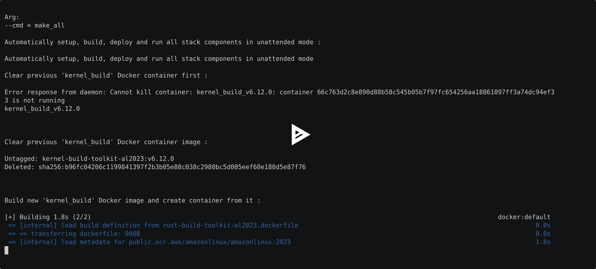
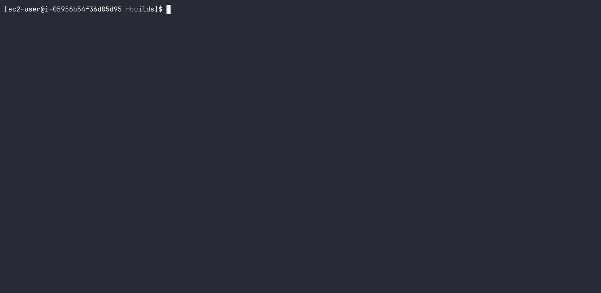
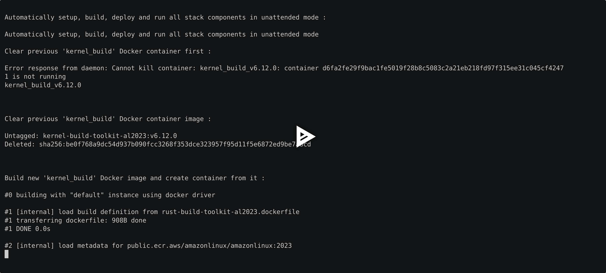
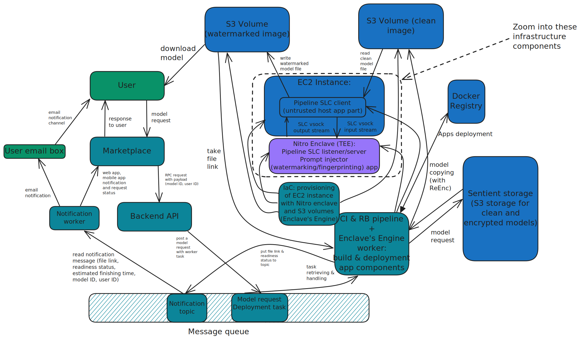

# Sentient Enclaves Framework for Trusted Confidential AI & Crypto Apps

## List of contents:

- [Building instructions and getting started (quick start) guide](../md/BUILDING.md)

- [Usage and advanced usage instructions, reference, guides](../md/USAGE.md)

- [Changelog: what's already done and implemented, release notes](../md/CHANGELOG.md)

- [Roadmap: what's in progress, in active development and upcoming features, release schedule](../md/ROADMAP.md)

## Supported platforms, system requirements:

Sentient Enclaves Framework built for AWS Nitro Enclaves.
Thus supported on EC2 instances with enabled `Nitro Enclaves` option.
Memory requirements should be equal to your application's Docker container image size multiplied by the grade of two (due to the initrd initramfs ramdisk with rootfs exported from app's Docker container + RAM for enclave).

Sentient Enclaves Framework was built with portability of components in mind.

More platforms and cloud based confidential VMs support (including confidential VMs with GPU TEE support) are coming very soon. (WIP)

## Overview:

### The Sentient Enclaves Framework contains the following components:

## Pipeline SLC VSock Communication Protocol

Pipeline VSock secure local channel (SLC) communication protocol, implemented as a client-server application,
that provides remote control of enclave via running shell commands inside the enclave
and provides bidirectional files transmission into/from enclave's file system.

It implements binary protocol over VSock for local communication,
which gives speed, user and developer experience with enclaves on par as Docker experience with containers.

## Encryption (WIP)

Sentient Enclaves Framework and specifically Pipeline SLC implementation supports strong P2P encryption and PRE multi-hop re-encryption, between host and enclave, enclave and S3 storage.

Encryption protocol implemented in Pipeline tool on a VSock buffer level and for content protection itself (data that transferred into and from enclave).

All the data outside the enclave are secured by strong encryption.

Pipeline supports SLC buffer level encryption for secure data transferring without leaks between enclave and host, and content encryption (encryption/decryption protocol and test tools) between host and outer storage (S3 at the moment), and multi-hop PRE re-encryption protocol and test tools for data protection between enclave and third-party systems during data transferring though many points in the cloud or for content protection between many participants/users in a network and on Sentient platform.

Keys are stored securely in a KMS service and locally can be stored in TPM devices (on EC2 instance). (WIP)

## Transparent VSock Proxies

Transparent VSock Proxies supports port forwarding and NAT for inbound and outbound TCP streams, and include original destination address retrieving from TCP stream, with sending/receiving requests/responses to/from original destination address from request.

It gives full support of networking stack (securely, on demand, with kill-switch (WIP) for sensitive computations during run-time) for enclaves and for higher level networking protocols over VSock (VirtIO VM sockets) for data exchange in forward and reverse proxy mode, with ports aggregation up to full-cone scheme support, via NetFilter rules for Linux kernel networking subsystem.

It is heavily relying on Linux networking stack and custom reproducible Linux kernel builds with networking stack support for enclaves.

The reverse and forward proxying schemes are supported for p2p proxying, transparent port to VSock forwarding (many-to-many listeners scheme, with requiring according number of port forwaring proxies to listeners), and fully transparent proxying (full-cone NAT and port forwarding, with many-to-many listeners scheme, and requiring only one proxy instance for each side, host and enclave), to provide networking stack access for enclave apps (in case of forward proxy) and provide confidential services hosted in enclave (in case of reverse proxy).

## Web server and web protocol for remote attestation of enclave's run-time

Web server for remote attestation of base EIF image PCR hashes (computed statically on EIF enclave's image build stage, via reproducible building process) against its run-time computed PCR hashes (provides guarantees that running enclave from EIF image wasn't modified anyhow), and for per-file attestation of enclave's run-time file system from inside the enclave.

Web API protocol for remote attestation of enclave's file system from inside the enclave supports per-file proofs generation and proofs verification, for file's content (external additional data, like model heavyweight tensor layers and data sets) placed in enclave run-time (in ramdisk or CoW disk image), signing and verifying of attestation documents right from inside the enclave (and using KMS service requests from inside the enclave).

The attestation process provides integrity, granularity, and guarantees that computation process on data, data producing or just data placing, was performed exactly inside the secure enclave's isolated environment, which prevent leakage of sensitive data and makes computational processes private and confident.

This way the attestation protocol and web API along with File System Monitor CoW layer covering all aspects of enclave's run-time activities and apps executed inside the enclave.

## Enclave's file system monitor

Enclave's file system monitor (for ramdisk or CoW image) supports unconditional attestation for all outer external additional data that will be appeared in enclave file system and run-time.

It guarantees that all data, data producers and data handlers in enclave will be attested unconditionally in unattended mode.

This improves guarantees for computational processes and eliminate chances for data leaks and backdoors installation inside the enclave.

It integrated into web server and FS monitor maintains attestation documents database.

## Build system for enclave's reproducible builds

Build system for enclaves supports reproducibility of enclave's environment for application running in it, and guarantees reproducibility of building processes and final isolated enclave environment for apps, during enclave and application static build phase.

It can be embedded with integration machine (GitHub Actions, any other self-hosted or cloud CI) to perform continuous integration (CI) process for building and shipping apps and enclaves for them in DevOps pipelining enterprise software application environment and deployments.

Build system operates with custom but standard Unix/BSD and Linux tools, not relying on any third party or non-standard software.

Build system rebuild reproducibly custom Linux kernel for networking stack support, and rebuild reproducibly of custom Init system for running apps processes inside enclave and for KVM hypervisor interaction during enclave's boot process, during enclave's run-time and termination at the enclave's EOL.

## Demonstrations:

### Reproducible builds demo:

### Reproducible builds demo with full IO:

### Enclave's networking demo (WIP):

## Visualization of Sentient Enclaves Framework infrastructure, components and its interaction, with diagrams:

### Whole Infrastructure bird-eye view:

### TEE Infrastructure:

### Topics:
- [#tee](https://github.com/topics/tee)
- [#trusted-execution-environment](https://github.com/topics/trusted-execution-environment)
- [#confidential-computing](https://github.com/topics/confidential-computing)
- [#confidential-ai](https://github.com/topics/confidential-ai)
- [#nitro-enclaves](https://github.com/topics/nitro-enclaves)
- [#nitro-enclave](https://github.com/topics/nitro-enclave)
- [#amd-sev-snp](https://github.com/topics/amd-sev-snp)
- [#intel-tdx](https://github.com/topics/intel-tdx)
- [#nvidia-tee](https://github.com/topics/nvidia-tee)
- [#nvidia-gpu-tee](https://github.com/topics/nvidia-gpu-tee)
- [#gpu-tee](https://github.com/topics/gpu-tee)

